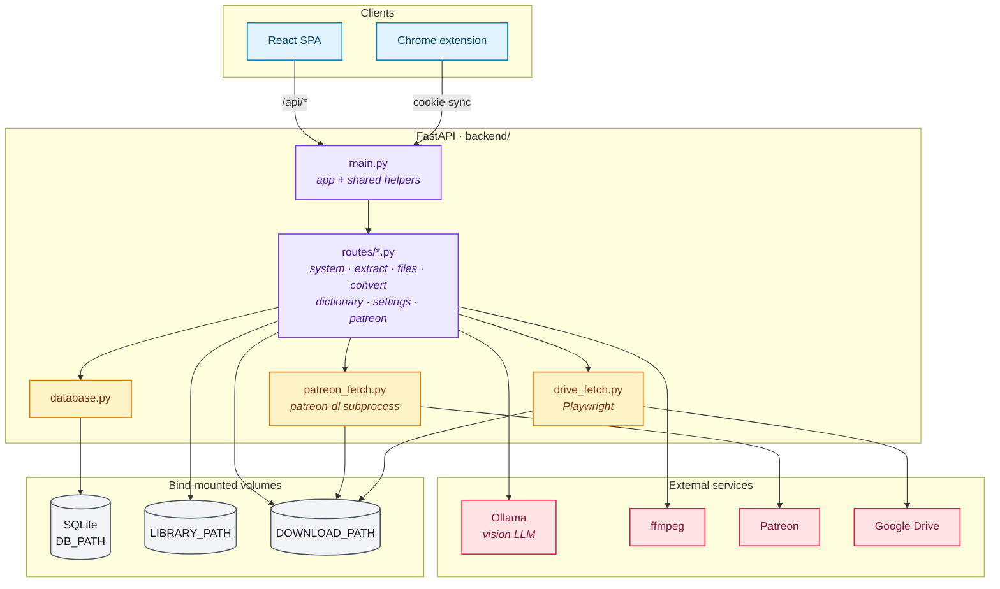

---
paths:
  - "backend/**"
  - "frontend/src/lib/**"
  - "frontend/src/App.tsx"
---

# Architecture Reference

## System overview

## Request flow

1. User pastes/uploads a Patreon screenshot in the React UI.
2. Frontend base64-encodes it and POSTs to `/api/extract`.
3. Backend sends the image to Ollama (`qwen2.5vl` by default) with a structured prompt.
4. The raw LLM JSON is returned to the frontend.
5. `frontend/src/lib/parser.ts` parses the response — title splitting (pipe or parenthetical) and tag normalisation happen client-side.
6. Tags are matched against the vocabulary dictionary (fetched from `/api/dictionary`).
7. The final filename is assembled in the UI and optionally applied via `/api/rename`.

## Backend route groups (under `backend/routes/`)

Routes are split by domain into `backend/routes/*.py`. Each module exports an `APIRouter`; `backend/main.py` constructs the app, holds the shared helpers (validators, metadata writer, ingest path builder) + module-level state, and registers the routers via `app.include_router(...)`. Route modules import shared helpers from `backend.main`. The Drive-scrape semaphore lives next to its only caller in `backend/routes/patreon.py`.

- `/api/extract`, `/api/preview-tags` — Ollama integration (vision LLM).
- `/api/dictionary`, `/api/vocabulary/*`, `/api/suppressed/*` — dictionary CRUD.
- `/api/files*` — file browser rooted at the requested `root` (`library` → `LIBRARY_PATH`, `downloads` → `DOWNLOAD_PATH`). Default is `library`.
- `/api/rename` — file rename + optional ID3/FLAC/MP4 metadata write via `mutagen`. Takes a `root` field, same options as above.
- `/api/convert` — audio conversion via `ffmpeg` subprocess. Takes a `root` field.
- `/api/mkdir` — create a subfolder under `LIBRARY_PATH/<parent>/`. Scoped to `LIBRARY_PATH` only.
- `/api/move` — move a file from `from_root` (library or downloads) into `LIBRARY_PATH/<to_subdir>/`, optionally renaming during the move. Uses `shutil.move` so the operation crosses mounts.
- `/api/settings/patreon-cookie`, `/api/patreon/*` — Patreon cookie storage + post fetch (delegates to `backend/patreon_fetch.py`); ingest endpoints write to `DOWNLOAD_PATH`.
- `/api/system/info` — Ollama model and app version. Consumed by the Header (formerly also carried an `os_explorer` capability flag for a host-subprocess file-manager launcher; removed when the in-app `LibraryExplorerSheet` replaced that approach).
- `/` — SPA fallback serving `frontend/dist/index.html`.

## Module responsibilities

- **`backend/main.py`** — FastAPI app construction, lifespan, SPA fallback, shared dependencies (validators, env paths, helpers), router registration. Route handlers live under `backend/routes/`.
- **`backend/routes/`** — one module per domain (`system`, `extract`, `files`, `convert`, `dictionary`, `settings`, `patreon`). Each exports an `APIRouter` named `router`. Imports shared helpers from `backend.main`.
- **`backend/database.py`** — SQLite schema, seeding (`DEFAULT_VOCABULARY`, `DEFAULT_SUPPRESSED`), all CRUD helpers. No ORM. Stores the Patreon session cookie under `PATREON_COOKIE_KEY`.
- **`backend/patreon_fetch.py`** — subprocess wrapper around `patreon-dl`; reads cookie from the DB. After patreon-dl writes into its nested tree under `DOWNLOAD_PATH/.patreon-dl/`, `_flatten_audio` moves each post's audio out to `DOWNLOAD_PATH/<creator>/<post_id> - <title>/<file>` (path built by `audio_utils.flatten_dest_parts`, also used by the Drive + external-audio ingest endpoints in `backend/routes/patreon.py` so all writers land in the same shape). Legacy `<post_id>/<file>` from earlier runs is still recognised by the cached-sidecar lookup so re-fetches don't miss it.
- **`backend/drive_fetch.py`** — Playwright-driven Drive scrape behind `/api/patreon/ingest-drive-link`. Loads the Drive viewer with the synced Google cookie, intercepts the playback URL, streams the audio. Serialises per-account via a semaphore — Google's mid-stream cookie rotation can't be raced.
- **`backend/audio_utils.py`** — pure helpers shared between the FastAPI handlers and `drive_fetch.py`: URL cleaning, filename derivation, audio-stream preference. Lives separately so the Playwright module imports it without a circular dependency back into FastAPI.
- **`frontend/src/App.tsx`** — root layout, dark mode, global state (dict, extracted tags, selected file), orchestrates all panels. No state library.
- **`frontend/src/lib/parser.ts`** — all LLM response parsing: title/tag extraction, pipe vs. parenthetical splitting, alias normalisation. **Client-side only.**
- **`frontend/src/lib/api.ts`** — thin `fetch` wrapper (GET/POST/PUT/PATCH/DELETE); all API calls go through here.
- **`frontend/src/lib/types.ts`** — shared TypeScript interfaces (`VocabEntry`, `AppDict`, `FileEntry`, etc.).
- **`frontend/src/lib/audio-formats.json`** — canonical list of supported audio extensions and output formats; read by both the UI and the backend at startup.

## Environment variables

| Variable          | Default                  | Purpose                                                       |
| ----------------- | ------------------------ | ------------------------------------------------------------- |
| `LIBRARY_PATH`    | — (**required**)         | Curated audio archive — root for the FileBrowser Library tab and the destination for the Move-to-library step. Backend errors on startup if unset. |
| `DOWNLOAD_PATH`   | — (**required**)         | Ingest staging — where patreon-dl, Drive scrape, external-audio ingest write. Root for the FileBrowser Downloads tab. Backend errors on startup if unset or equal to `LIBRARY_PATH`. |
| `DB_PATH`         | `/data/dictionary.db`    | SQLite database location                                      |
| `OLLAMA_BASE_URL` | `http://localhost:11434` | Ollama server endpoint                                        |
| `OLLAMA_MODEL`    | `qwen2.5vl:7b`           | Vision model for extraction                                   |
| `DRIVE_SCRAPE_CONCURRENCY`    | `1`            | Concurrent Drive scrapes per account. Default serialises so Google's mid-stream cookie rotation can't be raced. |
| `DRIVE_BROWSER_IDLE_TIMEOUT_S`| `300`          | How long the shared Chromium stays alive between Drive scrapes. |
| `DRIVE_DOWNLOAD_TIMEOUT_S`    | `14400`        | Max time per Drive download (4 h). Google's signed-URL expiry caps the useful range around 6 h. |
| `DRIVE_DOWNLOAD_RETRIES`      | `4`            | Retry attempts per Drive download. |
| `PATREON_DL_BIN`              | `patreon-dl`   | patreon-dl binary name / path. |

The full README's `Configuration` table is authoritative for user-facing copy; the table above is the short reference for contributors.

In Docker, both paths are bind-mounted via `LIBRARY_PATH` + `DOWNLOAD_PATH` in `.env` (host) → `/mnt/audio` + `/mnt/downloads` (container). The devcontainer mounts them at the same container paths and runs as `devuser` in `/workspaces/asmr-curator`. The two host paths must be distinct directories.

## Dev vs. production

In **dev**, Vite proxies `/api/*` to `http://localhost:8000` (configured in `vite.config.ts`). Frontend (port 5173) and backend (port 8000) run as separate processes.

In **production** (Docker), a multi-stage build compiles the React app and copies `frontend/dist/` into the Python image. FastAPI serves both the SPA and the API from port 8000. `audio-formats.json` is copied into the production image so the backend can read it at startup.
